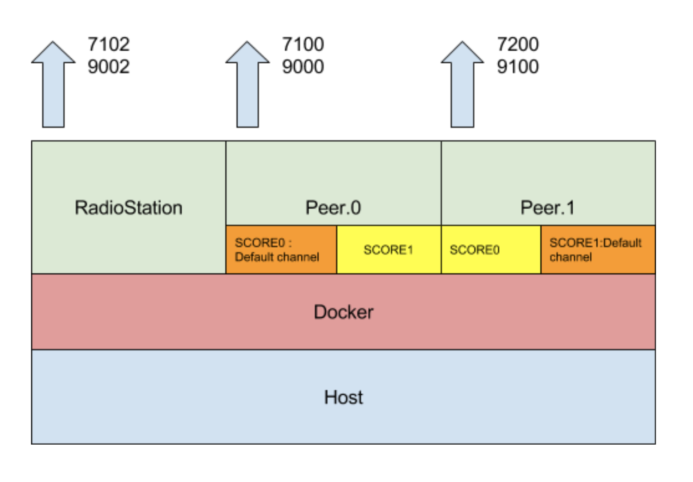

Local computer에서 RadioStation과 2개의 Peer로 한 장비 위에서 Blockchain network 구성하기
==================


## 목적

 RadioStation과 Peer 2개로 구성된 네트워크 환경을 구성하고 테스트합니다.




## Prerequisite

- [공통사항](https://github.com/theloopkr/loopchain_tutorial/blob/master/README.md)


## 프로젝트 구성

```
├── README.md
├── conf
│   ├── channel_manage_data.json
│   ├── peer_conf0.json
│   ├── peer_conf1.json
│   └── rs_conf.json
├── delete.sh
├── fluentd
│   └── etc
│       └── fluent.conf
├── img
│   └── step2_arch.png
├── start.sh
└── stop.sh
```


## 환경변수등록

```
$ export TAG=latest
```


## 설정 파일 생성

### 1. Log서버 (fluentd)의 설정파일(`fluent.conf`) 및 로그 디렉토리 생성

```
$ mkdir -p fluentd/etc
$ mkdir logs
$ vi fluent.conf
```

다음 내용 작성을 작성합니다.
```
<source>
	@type forward
	@id input1
	port 24224
	bind 0.0.0.0
</source>

<match **> # Add your log tag to show in <>.
	@type copy
	<store> # Add your log tag to show in <>.
		@type file # Leave log file in path.
		path /logs/data.*.log
		symlink_path /logs/data.log
		time_slice_format %Y%m%d
		time_slice_wait 10m
		time_format %Y%m%dT%H%M%S%z
		compress gzip
		utc
	</store>
</match>
```
작성된 `fluent.conf`를 `fluentd/etc` 디렉토리로 이동

```
$ mv fluent.conf ./fluentd/etc
```

### 2. 환경설정 디렉토리 생성

```
$ mkdir   conf
```

### 3. Peer들이 실행할 SmartContract 지정 환경설정 생성(`channel_manager_data.json`)

```
$ touch channel_manage_data.json
$ printf '{"channel1": {"score_package": "loopchain/default"} } \n' > channel_manage_data.json
$ mv channel_manage_data.json ./conf
```

### 4. RadioStation의 설정파일 생성(`rs_conf.json`)

```
$ touch rs_conf.json
$ printf '{"CHANNEL_MANAGE_DATA_PATH": "/conf/channel_manage_data.json", "LOOPCHAIN_DEFAULT_CHANNEL": "channel1","ENABLE_CHANNEL_AUTH": false}\n' > rs_conf.json
$ mv rs_conf.json ./conf
```

### 5. Peer0의 설정파일 생성(`peer_conf0.json`)

```
$ touch peer_conf.json
$ printf '{"LOOPCHAIN_DEFAULT_CHANNEL": "channel1","DEFAULT_SCORE_BRANCH": "master"}\n' > peer_conf0.json
$ mv peer_conf0.json ./conf
```

### 6. Peer1의 설정파일 생성(`peer_conf1.json`)

```
$ touch peer_conf.json
$ printf '{"LOOPCHAIN_DEFAULT_CHANNEL": "channel1","DEFAULT_SCORE_BRANCH": "master"}\n' > peer_conf1.json
$ mv peer_conf1.json ./conf
```


## Docker Image 다운로드 및 확인

```
$ docker pull loopchain/looprs:latest             # radio station
$ docker pull loopchain/looppeer:latest.          # peer
$ docker pull loopchain/loopchain-fluentd:latest  # log server

...  
...
$ docker images
REPOSITORY                    TAG                 IMAGE ID            CREATED             SIZE
loopchain/looppeer            latest              8968af8c1721        2 days ago          783MB
loopchain/looprs              latest              f8bf3265a09b        2 days ago          783MB
loopchain/loopchain-fluentd   latest              95900cef2721        2 days ago          39.5MB
```


## Docker container 실행

### 1. log서버 실행

```
# 컨테이너실행
$ docker run -d \
--name loop-logger \
--publish 24224:24224/tcp \
--volume $(pwd)/fluentd:/fluentd \
--volume $(pwd)/logs:/logs \
loopchain/loopchain-fluentd:${TAG}

#컨테이너조회
$ docker ps --filter name=loop-logger
CONTAINER ID        IMAGE                                COMMAND                  CREATED             STATUS              PORTS                                           NAMES
2ce034c6a0c9        loopchain/loopchain-fluentd:latest   "/bin/entrypoint.s..."   42 minutes ago      Up 42 minutes       5140/tcp, 24284/tcp, 0.0.0.0:24224->24224/tcp   loop-logger
```

### 2. RadioStation 실행

```
# 데이터 저장소 생성
$ mkdir -p storageRS
# 컨테이너실행
$ docker run -d --name radio_station \
-v $(pwd)/conf:/conf \
-v $(pwd)/storageRS:/.storage \
-p 7102:7102 \
-p 9002:9002 \
--log-driver fluentd --log-opt fluentd-address=localhost:24224 \
loopchain/looprs:${TAG} \
python3 radiostation.py -o /conf/rs_conf.json

# 컨테이너조회
$ docker ps --filter name=radio_station
CONTAINER ID        IMAGE                     COMMAND                  CREATED             STATUS              PORTS                                                           NAMES
66038e146dbb        loopchain/looprs:latest   "python3 radiostat..."   41 minutes ago      Up 41 minutes       0.0.0.0:7102->7102/tcp, 7100-7101/tcp, 0.0.0.0:9002->9002/tcp   radio_station
```

### 3. Peer0 실행

```
# 데이터 저장소 생성
$ mkdir -p storage0

# 컨테이너 실행
$ docker run -d --name peer0 \
-v $(pwd)/conf:/conf \
-v $(pwd)/storage0:/.storage \
--link radio_station:radio_station \
--log-driver fluentd --log-opt fluentd-address=localhost:24224 \
-p 7100:7100 -p 9000:9000  \
loopchain/looppeer:${TAG} \
python3 peer.py -o /conf/peer_conf0.json -p 7100 -r radio_station:7102

# 컨테이너 조회
$ docker ps --filter name=peer0
CONTAINER ID        IMAGE                       COMMAND                  CREATED             STATUS              PORTS                                                           NAMES
2d44c7f5c7c7        loopchain/looppeer:latest   "python3 peer.py -..."   40 minutes ago      Up 40 minutes       0.0.0.0:7100->7100/tcp, 0.0.0.0:9000->9000/tcp, 7101-7102/tcp   peer0
```

### 4. Peer1 실행

```
# 데이터 저장소 생성
$ mkdir -p storage1

# 컨테이너 실행
$ docker run -d --name peer1 \
-v $(pwd)/conf:/conf \
-v $(pwd)/storage0:/.storage \
--link radio_station:radio_station \
--log-driver fluentd --log-opt fluentd-address=localhost:24224 \
-p 7200:7200 -p 9100:9100  \
loopchain/looppeer:${TAG} \
python3 peer.py -o /conf/peer_conf1.json -p 7200 -r radio_station:7102

# 컨테이너 조회
$ docker ps --filter name=peer1
CONTAINER ID        IMAGE                       COMMAND                  CREATED             STATUS              PORTS                                                                     NAMES
67f9144930b3        loopchain/looppeer:latest   "python3 peer.py -..."   10 seconds ago      Up 9 seconds        7100-7102/tcp, 0.0.0.0:7200->7200/tcp, 9000/tcp, 0.0.0.0:9100->9100/tcp   peer1
```


## 테스트

### 1. Peer 상태 조회

```
$ curl http://localhost:9000/api/v1/peer/list?channel=channel1
{"made_block_count": 0, "status": "Service is online: 1", "peer_type": "1", "audience_count": "0", "consensus": "siever", "peer_id": "dda42a52-e3ca-11e7-a336-0242ac110004", "block_height": 0, "total_tx": 0, "peer_target": "172.17.0.4:7100", "leader_complaint": 1}

```

### 2. RadioStation의 `channel1`에 등록된 Peer 목록 조회

```
$   curl    http://localhost:9002/api/v1/peer/list?channel=channel1
{"response_code": 0, "data": {"registered_peer_count": 2, "connected_peer_count": 2, "registered_peer_list": [{"order": 1, "peer_id": "dda42a52-e3ca-11e7-a336-0242ac110004", "group_id": "dda42a52-e3ca-11e7-a336-0242ac110004", "target": "172.17.0.4:7100", "cert": "MFYwEAYHKoZIzj0CAQYFK4EEAAoDQgAE+HQPBowjyJnyinsYjiztl5i6hQ1JiWdpRmyFR1T283M4liQia7weerQQ4Qw6jDVwd+RkwHeenvR0xxovUFCTQg==", "status_update_time": "2017-12-18 08:10:32.290231", "status": 1, "peer_type": 1}, {"order": 2, "peer_id": "dde94092-e3ca-11e7-b730-0242ac110005", "group_id": "dde94092-e3ca-11e7-b730-0242ac110005", "target": "172.17.0.5:7200", "cert": "MFYwEAYHKoZIzj0CAQYFK4EEAAoDQgAE+HQPBowjyJnyinsYjiztl5i6hQ1JiWdpRmyFR1T283M4liQia7weerQQ4Qw6jDVwd+RkwHeenvR0xxovUFCTQg==", "status_update_time": "2017-12-18 08:10:32.695747", "status": 1, "peer_type": 0}], "connected_peer_list": [{"order": 1, "peer_id": "dda42a52-e3ca-11e7-a336-0242ac110004", "group_id": "dda42a52-e3ca-11e7-a336-0242ac110004", "target": "172.17.0.4:7100", "cert": "MFYwEAYHKoZIzj0CAQYFK4EEAAoDQgAE+HQPBowjyJnyinsYjiztl5i6hQ1JiWdpRmyFR1T283M4liQia7weerQQ4Qw6jDVwd+RkwHeenvR0xxovUFCTQg==", "status_update_time": "2017-12-18 08:10:32.290231", "status": 1, "peer_type": 1}, {"order": 2, "peer_id": "dde94092-e3ca-11e7-b730-0242ac110005", "group_id": "dde94092-e3ca-11e7-b730-0242ac110005", "target": "172.17.0.5:7200", "cert": "MFYwEAYHKoZIzj0CAQYFK4EEAAoDQgAE+HQPBowjyJnyinsYjiztl5i6hQ1JiWdpRmyFR1T283M4liQia7weerQQ4Qw6jDVwd+RkwHeenvR0xxovUFCTQg==", "status_update_time": "2017-12-18 08:10:32.695747", "status": 1, "peer_type": 0}]}}
```


## 실행스크립트

### 1. 시작 - `start.sh` (새로운 컨테이너 실행)

```
#!/usr/bin/env bash

##############################################
#           환경변수등록
##############################################
export TAG=latest
export CONF=$(pwd)/conf
export LOGS=$(pwd)/logs
export FLUENTD=$(pwd)/fluentd
export STORAGE_RS=$(pwd)/storageRS
export STORAGE_PEER_0=$(pwd)/storage0

##############################################
#       로그 및 데이터 디렉토리 생성
##############################################
if [ ! -d ${LOGS} ]
    then    mkdir -p ${LOGS}
fi

if [ ! -d ${STORAGE_RS} ]
    then    mkdir -p ${STORAGE_RS}
fi

if [ ! -d ${STORAGE_PEER_0} ]
    then    mkdir -p ${STORAGE_PEER_0}
fi

##############################################
#           로그서버실행
##############################################
docker run -d \
--name loop-logger \
--publish 24224:24224/tcp \
--volume ${FLUENTD}:/fluentd \
--volume ${LOGS}:/logs \
loopchain/loopchain-fluentd:${TAG}

##############################################
#           Radio Station 실행
##############################################
docker run -d --name radio_station \
-v ${CONF}:/conf \
-v ${STORAGE_RS}/storageRS:/.storage \
-p 7102:7102 \
-p 9002:9002 \
--log-driver fluentd --log-opt fluentd-address=localhost:24224 \
loopchain/looprs:${TAG} \
python3 radiostation.py -o /conf/rs_conf.json

##############################################
#           Peer0 실행
##############################################
-v $(pwd)/conf:/conf \
-v $(pwd)/storage0:/.storage \
--link radio_station:radio_station \
--log-driver fluentd --log-opt fluentd-address=localhost:24224 \
-p 7100:7100 -p 9000:9000  \
loopchain/looppeer:${TAG} \
python3 peer.py -o /conf/peer_conf0.json -p 7100 -r radio_station:7102


##############################################
#           Peer1 실행
##############################################
docker run -d --name peer1 \
-v $(pwd)/conf:/conf \
-v $(pwd)/storage0:/.storage \
--link radio_station:radio_station \
--log-driver fluentd --log-opt fluentd-address=localhost:24224 \
-p 7200:7200 -p 9100:9100  \
loopchain/looppeer:${TAG} \
python3 peer.py -o /conf/peer_conf1.json -p 7200 -r radio_station:7102
```

### 2. 종료 - `stop.sh` (실행 중인 컨테이너를 종료)

```
#!/usr/bin/env bash

docker stop $(docker ps -q --filter name=loop-logger --filter name=radio_station --filter name=peer0 --filter name=peer1)
```

### 3. 삭제 - `delete.sh` (종료된 컨테이너를 삭제)

```
#!/usr/bin/env bash

docker rm -f $(docker ps -aq --filter name=loop-logger --filter name=radio_station --filter name=peer0 --filter name=peer1)
```


