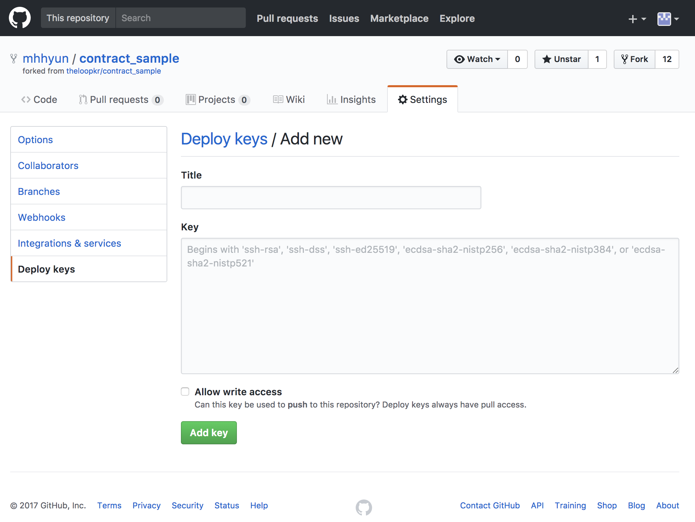

Local computer에서 SCORE개발 환경 만들기
===================

## 1. Loopchain SCORE란?

- Loopchain의 스마트 컨트렉트를 통칭합니다.
- 각 피어에서 독립적으로 실행되며, Block 이 확정되는 시점에서 실행됩니다.
- Block별로 실행하며, 블록체인으로 구성하는 비지니스로직을 구현한다.
- Python 언어로 개발되며, Loopchain의 dependency 를 따릅니다.


## 2. SCORE 저장소 생성

1. Github에서 [SCORE 프로젝트](https://github.com/theloopkr/contract_sample)를 Fork하여 테스트용 SCORE 저장소를 생성합니다.

   1. SCORE 프로젝트는 2개의 파일로 구성됩니다.
      1. package.json
      2. SCORE code ( ```*.py```파일)

2. SCORE 저장소와 SSH통신을 위해 ssh 키쌍을 생성합니다.

   ```bash
   $ssh-keygen
   Generating public/private rsa key pair.
   Enter file in which to save the key (/Users/wise/.ssh/id_rsa): id_tutorial

   $ cat id_tutorial.pub
   ssh-rsa AAAAB3NzaC1yc2EAAAADAQABAAABAQDu9aZIDq88VzIAStqjswToE+X0nn34jCQ0JELmsQuIjdve4lNSGJlyMmILFJzRnjX5MYqCWoEhSrE6z9kyRKf82hxyJdewNJK15kC8Se+5c19htrJ0cY47wzXQpm9YOPpEAvmYxUMpMLF2Km7MMHF7dhI/1HvMRn/b1Cab8Qkfzg8yzix0SJ35tnLkgVP1OAjxe1Lv/0puhm1eNkVxFKI48DzJ1d5GiDb99Dj6V4kmNcy3Hs9C8Ej4Vq69Jp7qSjKZg9j5F4M+ABq2h1EhyB9kVUTiZVlIFqqOr8f8ymG+YUY3QWx7LmmXlKIa0t9YCIGc5pJKHo1aTwR0wdM9zwhP ...
   ```

3. Github SCORE 저장소에 SSH public key 내용을 (예:id_tutorial.pub)를 등록합니다.

   

   ​

## 3. 환경설정

#### 1. Peer 설정 - `channel_manage_data.json `

score_package 속성에 SCORE 저장소 경로를 설정 `"score_package": "{your_github_id}/contract_sample"`

 ```
 {
   "channel1":
     {
       "score_package": "{your_github_id}/contract_sample"
     }
 }

 ```
#### 2. 시작스크립트에서 Peer실행 추가설정 - `launch_servers.sh`

1. SSH Key 경로설정 `-v "${SSH_KEY_FOLDER}:/root/.ssh/id_rsa`
2. SCORE 저장소 도메인 설정  `-e "DEFAULT_SCORE_HOST=github.com"`

```bash
...

docker run -d --name peer0 \
  -v $(pwd)/conf:/conf \
  -v $(pwd)/storage0:/.storage \
  -v $(pwd)/score:/score \
  -v "${SSH_KEY_FOLDER}:/root/.ssh/id_rsa \
  -e "DEFAULT_SCORE_HOST=github.com" \
  --link radio_station:radio_station \
  --log-driver fluentd --log-opt fluentd-address=localhost:24224 \
  -p 7100:7100 -p 9000:9000  \
  loopchain/looppeer:${TAG} \
  python3 peer.py -o /conf/peer_conf.json  -r radio_station:7102
  
...
```


## 4. 테스트

#### 1. Peer 목록 조회

```bash
$ curl http://localhost:9002/api/v1/peer/list | python -m json.tool

//결과
  % Total    % Received % Xferd  Average Speed   Time    Time     Time  Current
                                 Dload  Upload   Total   Spent    Left  Speed
100   855  100   855    0     0  13609      0 --:--:-- --:--:-- --:--:-- 13790
{
    "data": {
        "connected_peer_count": 1,
        "connected_peer_list": [
            {
                "cert": "MFYwEAYHKoZIzj0CAQYFK4EEAAoDQgAE+HQPBowjyJnyinsYjiztl5i6hQ1JiWdpRmyFR1T283M4liQia7weerQQ4Qw6jDVwd+RkwHeenvR0xxovUFCTQg==",
                "group_id": "c9850196-e559-11e7-bf35-0242ac110004",
                "order": 1,
                "peer_id": "c9850196-e559-11e7-bf35-0242ac110004",
                "peer_type": 1,
                "status": 1,
                "status_update_time": "2017-12-20 07:46:09.483471",
                "target": "172.17.0.4:7100"
            }
        ],
        "registered_peer_count": 1,
        "registered_peer_list": [
            {
                "cert": "MFYwEAYHKoZIzj0CAQYFK4EEAAoDQgAE+HQPBowjyJnyinsYjiztl5i6hQ1JiWdpRmyFR1T283M4liQia7weerQQ4Qw6jDVwd+RkwHeenvR0xxovUFCTQg==",
                "group_id": "c9850196-e559-11e7-bf35-0242ac110004",
                "order": 1,
                "peer_id": "c9850196-e559-11e7-bf35-0242ac110004",
                "peer_type": 1,
                "status": 1,
                "status_update_time": "2017-12-20 07:46:09.483471",
                "target": "172.17.0.4:7100"
            }
        ]
    },
    "response_code": 0
}
```

#### 2. Peer 상태 조회

```bash
$ curl http://localhost:9000/api/v1/status/peer | python -m json.tool

// 결과
  % Total    % Received % Xferd  Average Speed   Time    Time     Time  Current
                                 Dload  Upload   Total   Spent    Left  Speed
100   264  100   264    0     0  14355      0 --:--:-- --:--:-- --:--:-- 14666
{
    "audience_count": "0",
    "block_height": 2,
    "consensus": "siever",
    "leader_complaint": 1,
    "made_block_count": 2,
    "peer_id": "c9850196-e559-11e7-bf35-0242ac110004",
    "peer_target": "172.17.0.4:7100",
    "peer_type": "1",
    "status": "Service is online: 1",
    "total_tx": 2
}
```

#### 3. SCORE 버전 조회

```bash
$ curl http://localhost:9000/api/v1/status/score | python -m json.tool


// 결과
  % Total    % Received % Xferd  Average Speed   Time    Time     Time  Current
                                 Dload  Upload   Total   Spent    Left  Speed
100  1042  100  1042    0     0  16726      0 --:--:-- --:--:-- --:--:-- 16806
{
    "all_version": [
        "f58b8b3e955984a09674a1f74c493001678d706c",
        "b39064b358b84798f20f024fca066a113ec88b18",
        "99923ce139350cf8f37ef9f72fddf3f327da4d7a",
        "e25e2fba404bbc42b010c552d280063c704a0917",
        "909b1ee00a00f12f744f3d669232c6f4549e945f",
        "51f258059bcc4f1fa46ba3df8762b953e27fcdee",
        "359b1f79b8bf2064ce0605d4b081da43a845beda",
        "3d7195e1e98e38bdddab93fd03ee0c7aa0a20765",
        "669b6db3a6c085b3de96d7bd13bc19efc26162ae",
        "5136f28e83e3aaf6fabb0c0556b505ca5b95a44c",
        "a74476425197c2b2b009a180f24f52efec932da8",
        "95c0dd33b826c9b529a9f8b6b349e1b002bb9835",
        "71afe3ca44fa46acced9b12c80ad1951fe83e4bd",
        "f01986ae06e402a97e48bfddb31d5aeebe1dc07b",
        "99ece33bb62b8b1c61182d074351b5062311d2f5",
        "eabe94b94545faac1c8951fb31ef62a9f549cc5f",
        "f5aab582d9f390f5378daf08f54d08c071f15d0c",
        "f79c480fc7af6d02c79e1fe3191bbc471962166f",
        "e38140e76766f2e51f30858a0ee3c82a90b9c258",
        "af7c49743fecd315d4e4491751fbdae9b92dead7",
        "bcc0d0f05d1a219cd4ed47955a86b0e16d1b2778"
    ],
    "id": "mhhyun/contract_sample",
    "status": 0,
    "version": "f58b8b3e955984a09674a1f74c493001678d706c"
}
```

#### 4. SCORE Transaction 생성

```bash
$ curl -H "Content-Type: application/json" -X POST -d '{"jsonrpc":"2.0","method":"propose","params":{"proposer":"RealEstateAgent" , "counterparties": ["leaseholder","lessor"], "content": "A아파트 203동 803호를 보증금 1500 월세 70에 계약 2019년 8월 1일까지 임대함, 임대 취소시 ~~~ ", "quorum": "3"}}'  http://localhost:9000/api/v1/transactions | python -m json.tool

// 결과
  % Total    % Received % Xferd  Average Speed   Time    Time     Time  Current
                                 Dload  Upload   Total   Spent    Left  Speed
100   389  100   119  100   270   7321  16612 --:--:-- --:--:-- --:--:-- 16875
{
    "more_info": "",
    "response_code": "0",
    "tx_hash": "6f02e79ee73b248b78f156180906cfbea5af2755d90cb3f03fe4f9d16d94eaf3"
}
```

#### 5. SCORE Transaction 조회 - `tx_hash` 사용 

```bash
$ curl http://localhost:9000/api/v1/transactions/result?hash=6f02e79ee73b248b78f156180906cfbea5af2755d90cb3f03fe4f9d16d94eaf3 | python -m json.tool

// 결과
  % Total    % Received % Xferd  Average Speed   Time    Time     Time  Current
                                 Dload  Upload   Total   Spent    Left  Speed
100    66  100    66    0     0   5320      0 --:--:-- --:--:-- --:--:--  5500
{
    "response": {
        "code": 0,
        "jsonrpc": "2.0"
    },
    "response_code": "0"
}
```
